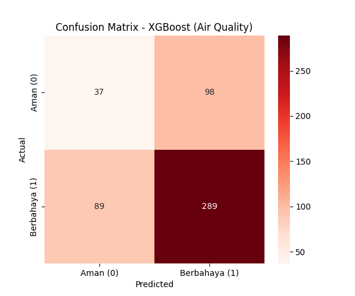
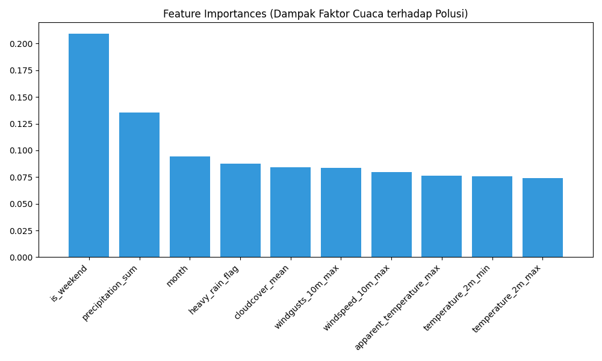

# Laporan Tugas Akhir: Prediksi Indeks Kualitas Udara (AQI) Menggunakan Data Meteorologi

**Mata Kuliah:** Metodologi Data Science
**Tema:** Prediksi Indeks Kualitas Udara (AQI) Menggunakan Data Meteorologi (*Weather-based Air Quality Forecasting*)
**Kelompok:** Anak Data Nih Bosh

**Anggota Kelompok:**
1. Marchell Adi Pratama (672023081)
2. Hendy Christian Nugroho (672023161)
3. Maria Anne Pujara (672023268)

---

## 1. Business Understanding
**Latar Belakang dan Proses Bisnis Saat Ini**
Kualitas udara merupakan salah satu indikator lingkungan yang berdampak langsung pada kesehatan masyarakat. Konsentrasi partikulat seperti PM2.5 dan PM10 serta gas berbahaya seperti NO2 dan SO2 dipantau secara rutin melalui stasiun pemantau kualitas udara, yang kemudian diinterpretasikan dalam bentuk Indeks Kualitas Udara (AQI). Saat ini, sistem penyampaian informasi kualitas udara umumnya bersifat reaktif, yaitu melaporkan status AQI berdasarkan pengamatan saat ini tanpa adanya peringatan dini terkait kemungkinan peningkatan polusi pada hari berikutnya.

**Permasalahan Bisnis (Business Problem)**
Pendekatan reaktif membatasi ruang bagi masyarakat maupun instansi terkait untuk melakukan tindakan preventif. Kualitas udara tidak hanya dipengaruhi oleh sumber emisi, namun juga berkorelasi dengan parameter meteorologi. Curah hujan dan kecepatan angin yang tinggi dapat membantu dispersi polutan, sementara kondisi atmosfer yang stabil dan suhu tertentu dapat menyebabkan polutan terakumulasi. Mengandalkan data historis AQI semata untuk melakukan peramalan belum cukup efektif. 

Oleh karena itu, diperlukan sebuah model pemelajaran mesin (*machine learning*) yang mampu memprediksi klasifikasi bahaya AQI (Aman atau Tidak Sehat) berdasarkan peramalan cuaca ke depan. Pendekatan ini diharapkan dapat memberikan peringatan dini (*early warning*) agar masyarakat dapat mempersiapkan diri sebelum terpapar kualitas udara yang buruk.

## 2. Data Collection and Understanding
**Data Collection (Pengumpulan Data)**
Data yang digunakan merupakan data sekunder yang dikumpulkan dari repositori terbuka, terdiri dari dua himpunan data:
1. **Dataset Kualitas Udara Global (`global_air_quality_dataset.csv`)**: Berisi observasi harian parameter polusi (AQI, PM2.5, PM10, NO2, dll.) di 10 kota besar pada tahun 2024 dengan total 3.662 baris.
2. **Dataset Cuaca Dunia (`worldwide_weather_2025.csv`)**: Berisi data iklim harian (Suhu, Curah Hujan, Angin, dll.) di 40 kota pada tahun 2025 dengan total 14.600 baris.

**Data Understanding (Pemahaman Data)**
Melalui proses eksplorasi data (*Exploratory Data Analysis*), ditemukan bahwa kedua dataset memiliki irisan sebanyak 7 kota yang sama. Mengingat pola klimatologi harian umumnya berulang secara tahunan (musiman), perbedaan tahun pencatatan pada kedua dataset ini dapat direkonsiliasi. Dataset cuaca tidak memiliki *missing values* yang signifikan, sementara atribut `AQI` pada dataset kualitas udara bertindak sebagai variabel respons kontinu.

## 3. Data Preparation
Tahapan integrasi dan pra-pemrosesan data dilakukan dengan langkah-langkah berikut:

1. **Time-Shifting Alignment:** Atribut tanggal pada dataset kualitas udara (2024) disesuaikan (*shifted*) menjadi 2025 agar sinkron dengan periode data cuaca.
2. **Data Integration:** Kedua dataset digabungkan (*inner join*) berdasarkan kunci komposit berupa entitas `City` dan atribut `Date`. Proses ini menghasilkan himpunan data terpadu yang memetakan kondisi meteorologi dengan capaian AQI pada hari yang sama.
3. **Pembentukan Variabel Target:** Variabel `AQI` didiskritisasi menjadi target klasifikasi biner. Nilai AQI $> 100$ (kategori tidak sehat/berbahaya) dilabeli sebagai kelas `1`, sedangkan nilai $\leq 100$ dilabeli kelas `0`.
4. **Feature Selection & Expansion:** Mengeliminasi variabel yang memicu *data leakage* dan menetapkan 10 atribut prediktor berbasis meteorologi: `temperature_2m_max`, `temperature_2m_min`, `apparent_temperature_max`, `precipitation_sum`, `windspeed_10m_max`, `windgusts_10m_max`, `cloudcover_mean`, `heavy_rain_flag`, `month`, dan `is_weekend`.
5. **Class Balancing & Splitting:** Data dipartisi menjadi himpunan latih (80%) dan himpunan uji (20%). Mengingat distribusi kelas target yang tidak seimbang, metode **SMOTE** diaplikasikan pada himpunan latih untuk menyeimbangkan representasi sampel.
6. **Feature Scaling:** Proses standardisasi (*Z-score normalization*) diterapkan menggunakan `StandardScaler`.

## 4. Modelling
**Alasan Pemilihan Model & Proses Modelling:**
Algoritma **XGBoost (Extreme Gradient Boosting)** dipilih karena efisiensinya dalam menangani relasi non-linear yang kompleks dan kemampuannya mengelola potensi *outlier* pada data deret meteorologi. Model diinisialisasi dengan parameter `n_estimators=150` dan `max_depth=5`. Proses pelatihan model dilakukan menggunakan pustaka Scikit-Learn dan XGBoost pada himpunan data latih, dan luaran model (berserta objek *scaler*) diekspor dalam format `.pkl` untuk keperluan peluncuran (*deployment*).

## 5. Evaluation
Kinerja model dikuantifikasi menggunakan *testing set*. Visualisasi di bawah ini menampilkan hasil evaluasi secara terstruktur.

### 5.1 Akurasi Prediksi (Confusion Matrix)
Dalam konteks prediksi bencana polusi udara, evaluasi ditekankan pada pengoptimalan metrik **Recall** untuk kelas positif. Hal ini bertujuan meminimalisasi *False Negative*, yaitu kondisi di mana model memprediksi udara aman padahal kenyataannya tingkat polusi berada pada ambang batas berbahaya.

### 5.2 Signifikansi Fitur (Feature Importance)
Grafik *Feature Importance* memperlihatkan bahwa suhu maksimal (`temperature_2m_max`) dan kecepatan angin (`windspeed_10m_max`) memiliki bobot yang paling dominan dalam penentuan kelas prediksi. Hal ini sejalan dengan tinjauan literatur yang menyatakan bahwa kelembapan atmosfer dan stagnasi sirkulasi udara berperan penting dalam pembentukan polutan tingkat permukaan.

## 6. Deployment
Sistem prediksi yang telah divalidasi kemudian direkayasa menjadi antarmuka aplikasi interaktif (*web-based application*).
1. **Antarmuka Front-End:** Aplikasi dibangun menggunakan kerangka kerja **Streamlit** (Python). Desain aplikasi dipartisi dalam tab fungsional untuk memudahkan pengguna dalam menginput metrik prakiraan cuaca, memantau *dashboard* hasil evaluasi model, dan membaca glosarium istilah terkait kualitas udara.
2. **Integrasi Back-End:** Model XGBoost diimpor untuk menghitung probabilitas polusi berdasarkan nilai masukan pengguna secara waktu nyata (*real-time processing*).
3. **Cloud Deployment:** Aplikasi ini ditempatkan pada server **Streamlit Community Cloud** yang terintegrasi secara *Continuous Deployment (CI/CD)* melalui repositori GitHub, sehingga memberikan ketersediaan akses publik yang stabil bagi kebutuhan demonstrasi maupun uji praktis lapangan.
